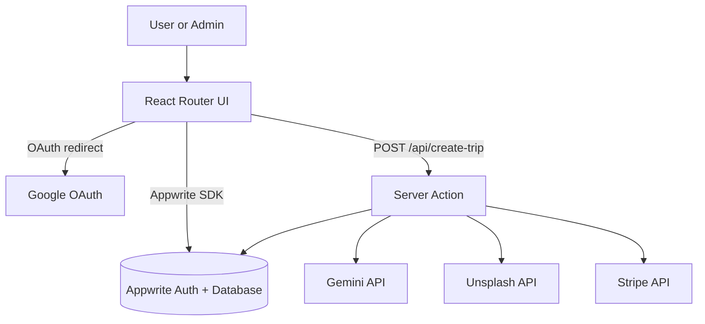
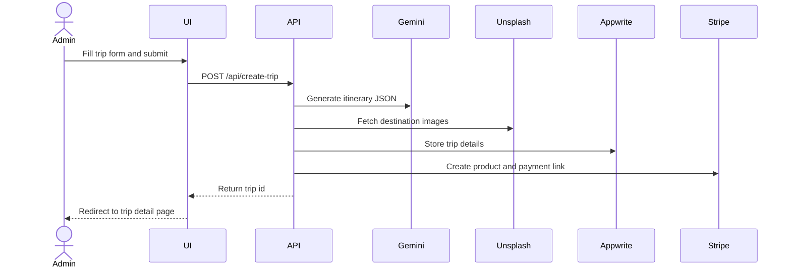

# 🧭 Tourvisto

    

AI-assisted travel itinerary planner with a public trips catalog and an admin dashboard.

Generates multi-day trip plans with Gemini, stores them in Appwrite, and sells trips via Stripe payment links.

---

# 🖼️ Preview / Screenshot


---

# 📌 What This Project Is

- AI-powered travel itinerary generator for multi-day trips.
- Public browsing experience for trip discovery and details.
- Admin dashboard for user management, trip creation, and analytics.
- Google OAuth sign-in handled through Appwrite.

---

# 🧱 Tech Stack

## Core Framework

- React
- React Router (SSR, loaders, actions)

## UI / Rendering

- Vite
- Tailwind CSS
- Syncfusion React UI (charts, grids, buttons, maps, navigation)
- canvas-confetti

## Data / Services

- Appwrite (Auth, Database)
- Stripe (payment links)
- Google OAuth (via Appwrite)

## AI / ML

- Google Gemini via `@google/genai`

## External APIs

- Unsplash API (trip imagery)
- REST Countries API (country list)

## Tooling

- TypeScript
- Prettier

## Infrastructure

- Docker

---

# 🗺️ Architecture Overview

The app is a React Router SSR application with public and admin route layouts. It uses Appwrite for authentication and data storage, generates itineraries on the server via Gemini, enriches trips with Unsplash images, and creates Stripe payment links for checkout.



---

# 🗂️ Project Structure

```
.
├─ app/
│  ├─ routes/
│  ├─ app.css
│  └─ root.tsx
├─ assets/
├─ components/
├─ constants/
├─ lib/
│  ├─ appwrite/
│  └─ stripe/
├─ public/
├─ types/
├─ utils/
├─ react-router.config.ts
├─ vite.config.ts
├─ package.json
└─ Dockerfile
```

- `app/` React Router routes, layouts, and global styles.
- `assets/` Static images and icons used by the UI.
- `components/` Reusable UI building blocks.
- `constants/` UI constants and chart/config values.
- `lib/` Integrations for Appwrite and Stripe.
- `types/` Global and environment type declarations.
- `utils/` Utility helpers for parsing and formatting.

---

# 🧩 Core Modules

**`app/routes.ts`**
Purpose: defines all public, admin, and API routes.
Interactions: maps route paths to UI and server action modules.
Design decisions: central route config for layout composition.

**`app/routes/api/create-trip.ts`**
Purpose: server action that generates and stores a trip.
Interactions: calls Gemini, Unsplash, Appwrite, and Stripe.
Design decisions: stores trip details as JSON and adds a payment link.

**`lib/appwrite/client.ts`**
Purpose: Appwrite SDK client setup and configuration.
Interactions: used by auth, trips, and dashboard queries.
Design decisions: reads Appwrite configuration from `import.meta.env`.

**`lib/appwrite/auth.ts`**
Purpose: Google OAuth login, session handling, and user persistence.
Interactions: Appwrite Account, Users collection, and Google People API for profile images.
Design decisions: creates a user document on first sign-in.

**`lib/stripe/index.ts`**
Purpose: Stripe product, price, and payment link creation.
Interactions: invoked by the create-trip action.
Design decisions: redirect URL built from `VITE_BASE_URL`.

**`app/routes/admin/index.tsx`**
Purpose: admin dashboard with stats, charts, and recent trips.
Interactions: pulls stats and lists from Appwrite and renders Syncfusion charts.
Design decisions: aggregates stats in `lib/appwrite/dashboard.ts`.

**`utils/parse-markdown-to-json.ts`**
Purpose: converts AI responses into JSON when formatting varies.
Interactions: used by the create-trip action before persistence.
Design decisions: tolerates code fences and partial JSON strings.

---

# 🔄 Runtime Flow

Trip creation flow (admin):



---

# ⚙️ Setup & Installation

Prerequisites:

- Node.js (Dockerfile uses Node 20)
- Appwrite project with Users and Trips collections
- Syncfusion license key
- Google OAuth configured in Appwrite (for sign-in)

Install dependencies:

```bash
npm install
```

---

# ▶️ Running the Project

Development:

```bash
npm run dev
```

Production build and server:

```bash
npm run build
npm run start
```

Type checking:

```bash
npm run typecheck
```

Docker (optional):

```bash
docker build -t tourvisto .
docker run -p 3000:3000 tourvisto
```

---

# 🔐 Configuration

Environment variables are loaded from `.env.local` for Vite and from the runtime environment for server actions.

| Variable                            | Description                                | Required |
| ----------------------------------- | ------------------------------------------ | -------- |
| `VITE_SYNCFUSION_LICENSE_KEY`       | Syncfusion license key for UI components   | Yes      |
| `VITE_APPWRITE_API_ENDPOINT`        | Appwrite endpoint URL                      | Yes      |
| `VITE_APPWRITE_PROJECT_ID`          | Appwrite project ID                        | Yes      |
| `VITE_APPWRITE_DATABASE_ID`         | Appwrite database ID                       | Yes      |
| `VITE_APPWRITE_USERS_COLLECTION_ID` | Appwrite users collection ID               | Yes      |
| `VITE_APPWRITE_TRIPS_COLLECTION_ID` | Appwrite trips collection ID               | Yes      |
| `VITE_BASE_URL`                     | Base URL for Stripe redirect after payment | Yes      |
| `GEMINI_API_KEY`                    | Google Gemini API key                      | Yes      |
| `UNSPLASH_ACCESS_KEY`               | Unsplash access key                        | Yes      |
| `STRIPE_SECRET_KEY`                 | Stripe secret key for server-side calls    | Yes      |

Optional local OAuth credentials file: `oauth.json.local` for Google OAuth configuration in Appwrite.

---

# 🚀 Usage

- Sign in with Google at `/sign-in`.
- Admin users can open `/dashboard` to view stats and create trips.
- Use the trip creation form to generate an itinerary and pricing.
- Browse trips on the homepage and open a trip to access the Stripe payment link.

---

# ⚠️ Limitations

- AI output parsing is best-effort and depends on Gemini returning valid JSON.
- Payment success relies on Stripe redirect only; no webhook verification is implemented.
- Trips are stored as a JSON string in Appwrite, which limits field-level querying.
- No caching layer is implemented for external API calls.

---

# 🔮 Future Improvements (Optional)

- Add Stripe webhook verification and booking status updates.
- Validate AI output with a schema before storing.
- Normalize trip fields in Appwrite for better querying and analytics.
- Introduce caching for country lists and image searches.

---

# 📄 License

MIT License. See [](./LICENSE).
